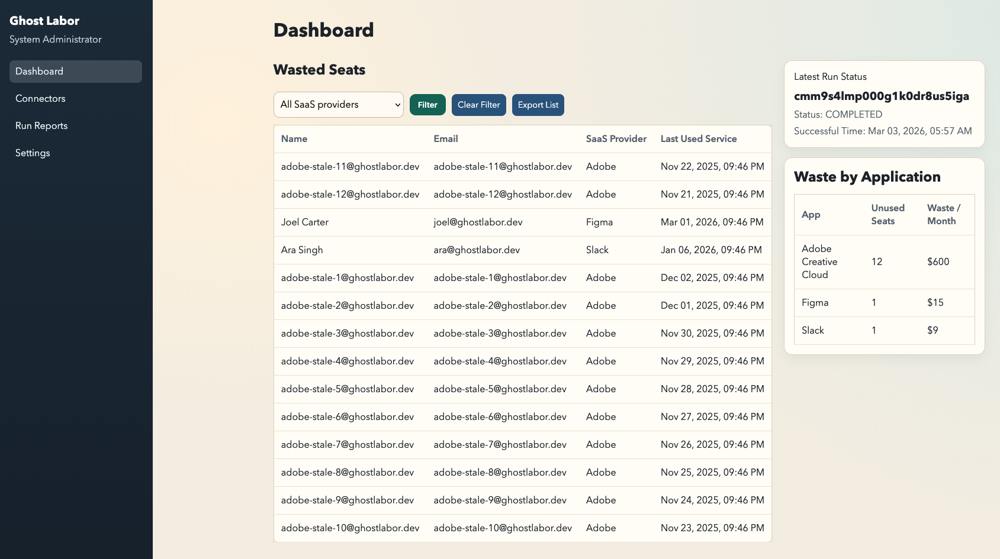

# Ghost Labor Detector

Monolithic web app to detect SaaS license waste by cross-referencing:
- HR directory (active/inactive employees)
- SaaS seat assignment + recent login activity

Stack:
- Next.js (App Router)
- Postgres
- Prisma ORM
- pg-boss (DB-backed job queue)

Runtime:
- Required: Node.js 24.x

## Why it matters
Finance teams can see immediate ROI with actionable findings like:
- 12 Adobe seats assigned to users not found in HR or inactive for 90+ days
- Potential savings: $600/month

## Architecture
- `app/` Next.js web + API routes
- `prisma/` schema + seed script
- `lib/report.ts` waste detection logic
- `lib/boss.ts` pg-boss queue and worker registration
- `app/api/admin/run-audit` queues audit jobs
- `app/api/reports/latest` returns latest audit report

## Sample UI


## Local setup
1. Start Postgres with Docker Compose (required before Prisma migrate):
   ```bash
   docker compose -f docker/docker-compose.yml up -d db
   ```
2. Install dependencies:
   ```bash
   npm install
   ```
3. Copy env:
   ```bash
   cp .env.example .env
   ```
4. Migrate and generate Prisma client:
   ```bash
   npm run db:migrate
   npm run db:generate
   ```
5. Seed bootstrap data (admin user + default settings):
   ```bash
   npm run db:seed
   ```
6. Start web app:
   ```bash
   npm run dev
   ```

Seeded login credentials:
- username: `admin`
- password: `admin123`

## App navigation
- `/` login page
- `/dashboard` landing page after successful login
- Side menu includes:
  - Dashboard
  - Connectors
  - Run Reports
  - Settings
  - Logout button

## Settings
- Report type channels:
  - Email
  - Slack message
  - Teams message
  - Telegram message
- Email integration:
  - Configure SMTP (`host`, `port`, `username`, `password/app password`, `secure`)
  - Configure `From Email` and recipient `To emails`
  - Optional `Reply-To`
  - Use `Test Email Connection` in Settings to verify configuration
- Slack integration:
  - Configure `Slack Webhook URL` (required for Slack delivery)
  - Optional `Slack Channel` override (for incoming webhook setups that support it)
  - Use `Test Slack Connection` in Settings to verify configuration
- Teams integration:
  - Configure `Teams Webhook URL`
  - Use `Test Teams Connection` in Settings to verify configuration
- Telegram integration:
  - Configure `Telegram Bot Token` and `Telegram Chat ID`
  - Use `Test Telegram Connection` in Settings to verify configuration
- Scheduling check interval (hours), persisted in DB (`AppSetting`)

## Connectors workflow
- Use `Create New Connector` from `/connectors`.
- Fill required connector fields and click `Validate Connection` to call the provider endpoint.
- Save behavior by validation result:
  - validated success -> `Connected`
  - validation failed -> `Error`
  - not validated -> `Draft`

Optional dedicated worker process (for production-style setup):
```bash
npm run worker
```

To stop the local Postgres container:
```bash
docker compose -f docker/docker-compose.yml stop db
```

## Product flow
1. Configure real connectors in `Connectors` with provider + API base URL + token.
2. `POST /api/integrations/sync` performs real connector sync.
3. Synced users are mapped into `Employee` and `SaaSSeat`.
4. `POST /api/admin/run-audit` queues an audit job in pg-boss.
5. Worker evaluates active seats and persists `WasteFinding` records.
6. Dashboard and `GET /api/reports/latest` show findings + monthly savings.

## Detection rules
A seat is flagged as waste when any condition is true:
- assignee email does not map to an active HR employee
- employee is inactive (left company)
- last login is older than app-level inactivity threshold

## Notes
- No external service is required; job queue and app data both live in Postgres.
- Supported SaaS providers in connector forms:
  - Adobe
  - Confluence
  - Figma
  - Google Workspace
  - Jira
  - Microsoft Entra ID
  - Slack
- Built-in dedicated sync adapters currently include `Google Workspace` and `Microsoft Entra ID`.
- Other listed providers currently use a generic integration contract: `GET {apiBaseUrl}/users` with bearer token auth.
